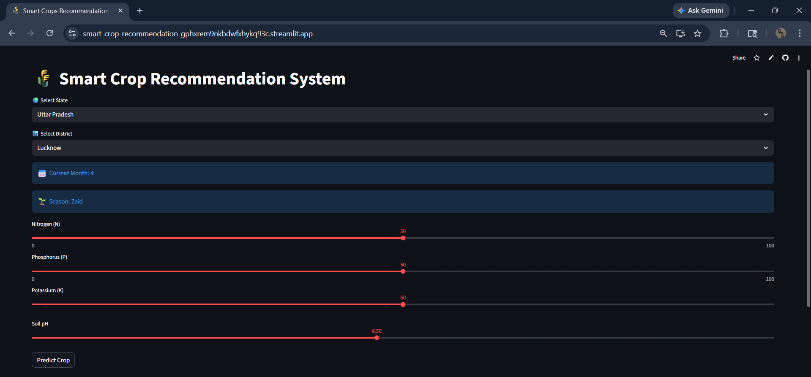
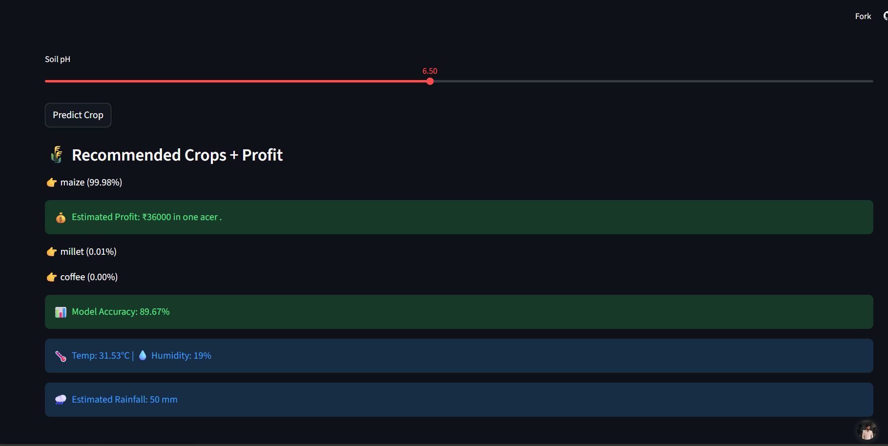

🌾 Smart Crop Recommendation System (AI Pro)

A machine learning-powered web application that recommends the most suitable crops based on soil nutrients, environmental conditions, and real-time weather data using an interactive dashboard.

* Through this application it becomes easier for farmers to choose crops accordingly to weather.

------------------------------------------------------------------------------

🚀 Live Demo
By clicking on this link you can use the application.
👉 ("https://smart-crop-recommendation-gphxrem9nkbdwfxhykq93c.streamlit.app/")

-------------------------------------------------------------------------------

📌 Overview

This project provides an intelligent solution for crop selection by combining machine learning, real-time weather data, and agricultural rules. Users can select their location (state & district), input soil parameters, and get accurate crop recommendations through a clean and interactive interface.

---------------------------------------------------------------------------------

✨ Features

* 🌍 Location-based selection (State & District dropdown)
* 🌡️ Real-time weather integration (Temperature & Humidity)
* 🤖 Machine Learning-based crop prediction (Gradient Boosting)
* 🎯 Top 3 crop recommendations
* 🌱 Realistic filtering using agricultural rules
* 📊 Model accuracy display
* ⚡ Fast and responsive UI using Streamlit

----------------------------------------------------------------------------------
🛠️ Tech Stack

| Category      | Tools Used                       |
| ------------- | -------------------------------- |
| Language      | Python                           |
| Framework     | Streamlit                        |
| Data Handling | Pandas, NumPy                    |
| ML Model      | Scikit-learn (Gradient Boosting) |
| API           | OpenWeatherMap                   |
| Visualization | Streamlit UI                     |

--------------------------------------------------------------------------------

📸 Preview

<p align="center">
  
</p>
<br>
<p align="center">
 
</p>


------------------------------------------------------------------------------
📁 Project Structure

```bash
Crop Analysis/
│
├── app.py
├── model.py
├── weather.py
├── Crop.csv
├── india_districts.csv
├── requirements.txt
├── README.md
└── assets/
     └── output.png
```

-------------------------------------------------------------------------------

🧠 How It Works

1. User selects **State & District**
2. App fetches **real-time weather data**
3. User inputs soil parameters (N, P, K, pH, rainfall)
4. ML model predicts **Top crops**
5. Output is refined using **agriculture-based rules**
6. It also shows profits in one acer.

-------------------------------------------------------------------------------

🌱 Use Case

* Helps farmers choose the best crops
* Useful for agriculture students & research
* Supports data-driven farming decisions

-------------------------------------------------------------------------------

⚠️ Disclaimer

* Predictions are AI-based and may not be 100% accurate
* Dataset is realistic but not official government data

------------------------------------------------------------------------------

👨‍💻 Author
<h1>Gaurav Dubey</h1>


	
